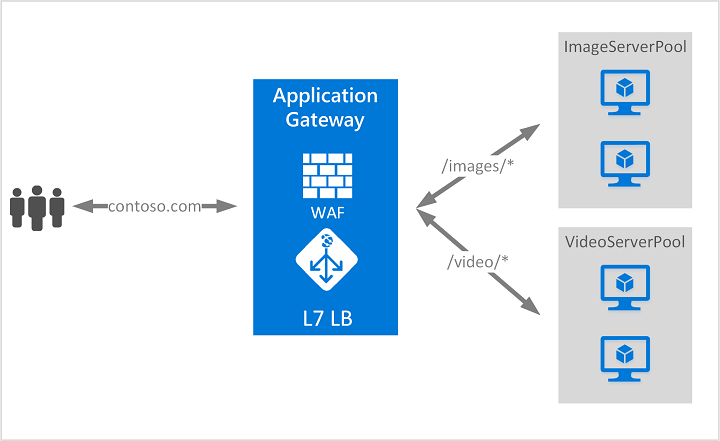

# VMs

1. Both Windows and Linux supported.
2. Windows works on RDP (port 3389), can be imported in Remmina.
    1. For graphics, use True Color (32bpp)
3. Can be used to create:
    1. Web Servers : using IIS
    2. Email Servers
    3. Database Servers.
4. (Udacity only) : While selecting image, select **Windows Server 2019 Datacenter Gen1** only. 

# High Availability

## Availability within same region:

### VM Scale Sets

1. Service that combines group of VMs to be run as a single unit.
2. Uses load balancing and/ or  auto scaling to keep applications/ data in the VM and ensure high availability.
3. Accessible after increased resource usage.
4. Maintains **High Availability** and **Application Resiliency**.
5. Application can auto scale using as resource usage changes.
6. **Not necessary to be on the same Azure Zone.**

### Availability Set

1. Places VMs into different multiple isolated physical machines **within the same datacentre**.
2. Uses:
    1. Fault Domains: 
        1. Used in cases where one VM fails to start due to some fault.
        2. It is a rack of servers consuming subsystems, such as power and networks.
    2. Update Domains: 
        1. Used in cases where one VM fails to start due to updates happening.
        2. A grouping of all VMs that will update and reboot together.
3. Does not help if entire datacentre goes down.
4. SLA: 99.5%

### Availability Zones

1. Instead of having all VMs in the same datacentre, VMs are logically placed into different physical devices across **different datacentres** within **the same region**.
2. Intentionally placed within the same region to reduce **latency**.
3. SLA: 99.95%

## Availability across different regions : Load Balancers

### Application Gateway

1. If you want to load balance between your servers in a region at the application layer, use **Application Gateway**.
2. Works at Application Layer (L7).
3. Performs URL Based routing.

### Front Door

1. If you need to optimize global routing of your web traffic and optimize top-tier end-user performance and reliability through quick global failover, use **Front Door**.
2. Uses Microsoft’s global edge network.
3. Works at Application Layer (L7).
4. Performs TCP encryption and decryption, so work less on Web Server.

Note: L7 Load Balancer:

### Azure Load Balancer

1. To do network layer load balancing, use **Load Balancer**.
2. Network Layer (L4) load balancer.
3. Uses **health probes** to monitor load-balanced resources.

### Traffic Manager

1. DNS Based Load Balancer.
2. Distribute traffic across global azure region.
3. Checks DNS of incoming traffic and routes to nearest region datacentre.

# Application Services

HTTP Service in Azure for hosting REST APIs, Web and Mobile Applications.

1. Only deploy the app, no need for server maintenance.
2. Global scale with High Availability.
3. Serverless Code (not dependent on the server).
4. Deploy application templates (DNN, Joomla, Wordpress).
5. Security and Compliance.
6. Managed Production Environment (You don’t have to worry about maintenance of server).
7. Supports multiple languages and frameworks.

# SLAs

1. App Service (99.95%)
2. Cloud Services (99.5%) 2 or more availability sets
3. VMs (99.9%)
4. Azure Active Directory: 99.9%

# Cloud Design Patterns

1. Design for self healing.: Script that restores original state.
2. Design for self redundancy.: Load balancing
3. Design to scale out.: VM Sets, etc.
4. Design for evolution.: Design such that application can bhi upgraded without downtime
5. Design for operations.
6. Managed Services. :  App Service.
7. Focus on business needs: Due to 6

# Cloud Design Patterns

1. Big Computer: 3D rendering, stuff that require more compute power.
2. Big Data: Data Analytics at scale
3. Event driven architecture: IoT
4. Microservices: Splitting multiple independent components
5. N-tier application : Presentation, Business, DB layer

# Design a Network Solution in Azure

## Factors to Consider

1. Latency
2. Security
3. Speed
4. Redundancy for Network

## Tools

1. VNET/ VNET Peer: Connect different services within Azure
2. Gateway : Control communication to and from on-site to Azure through VPN or ExpressRouter
3. VPN : Allow communication to and from on-site to Azure
4. Network Watcher : Troubleshoot potential issues with network

## Methods to communicate between Azure resources

1. Using Virtual Network.
2. Virtual Network endpoint
3. VNET Peering
4. Private link.

## Communication with on-premises

1. Point-to-site VPN
    1. A Point-to-Site (P2S) VPN gateway connection lets you create a secure connection to your virtual network from an individual client computer. 
    2. A P2S connection is established by starting it from the client computer. 
    3. This solution is useful for telecommuters who want to connect to Azure VNets from a remote location, such as from home or a conference. 
    4. P2S VPN is also a useful solution to use instead of S2S VPN when you have only a few clients that need to connect to a VNet.
    5. Uses following protocols:
        1. OpenVPN
        2. SSTP
        3. IKEv2 VPN
2. Site-to-Site
3. Azure ExpressRoute
    - Layer 3 connectivity between your on-premises network and the Microsoft Cloud through a connectivity provider. Connectivity can be from an any-to-any (IPVPN) network, a point-to-point Ethernet connection, or through a virtual cross-connection via an Ethernet exchange.
    - Connectivity to Microsoft cloud services across all regions in the geopolitical region.
    - Global connectivity to Microsoft services across all regions with the ExpressRoute premium add-on.
    - Dynamic routing between your network and Microsoft via BGP.
    - Built-in redundancy in every peering location for higher reliability.
    - Connection uptime SLA.
    - QoS support for Skype for Business.

## Policy vs Route based VPNs

1. Policy based VPN
    1. Uses a combination of prefixes from both networks to determine how traffic is encrypted/ decrypted through IP tunnels.
    2. Allows for multiple VPNs via single VNET gateway.
    3. Does not support VPN diagnostics in Azure.
2. Route based VPN
    1. Use any-to-any traffic selectors and routing/ forwarding tables to redirect traffic through different IPSec tunnels.
    2. If your devices support it, this is the better Policy Based.
    3. Can perform VPN diagnostics in Azure.

## Fault Tolerant Configurations

1. Active/ Standby: If any planned/ unplanned maintenance on Active, Standby will automatically failover for VNet - VNet connection.
2. Active/ Active: Both instances of VPN tunnels will be established. If any planned/ unplanned maintenance on 1 Active, 2nd active will be used in its place.
3. ExpressRoute failover: If there is loss of network in ExpressRoute site to site, then automatically failover to IPSec tunnel.
4. Zone redundant gateway: Deploy network gateway across multiple zones.

## Network Security Group

1. Basic cloud based firewall.
2. Securing traffic.
3. A network security group contains security rules that allow or deny inbound network traffic to, or outbound network traffic from, several types of Azure resources.
4. Also, secure your storage account.